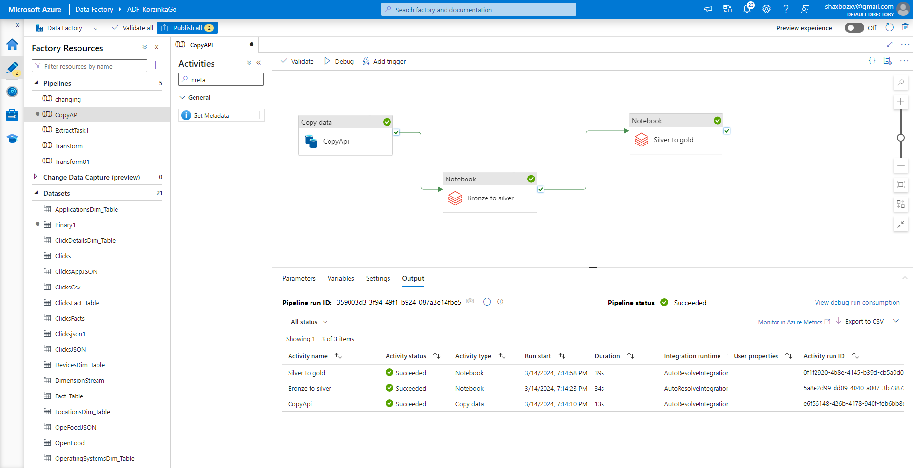
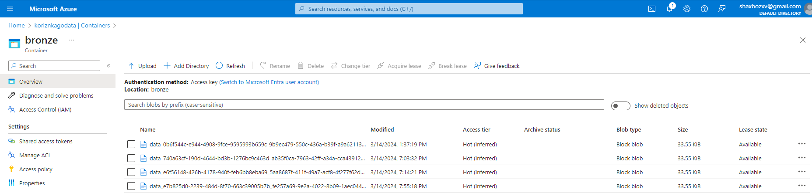
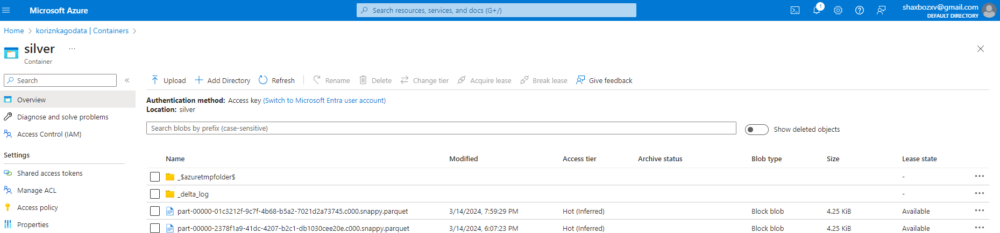
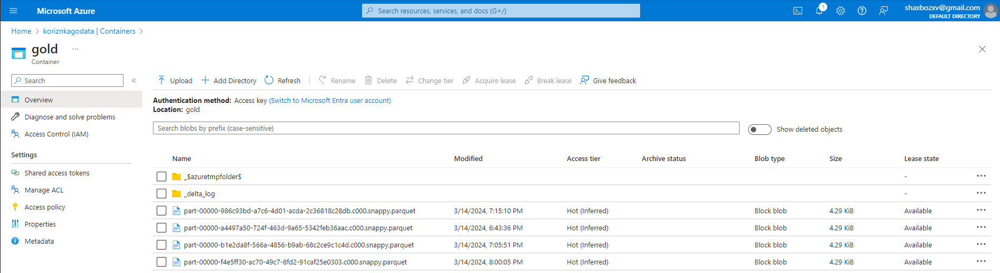

# KorzinkaGoTask_2
Design and implement an ETL process to extract data from the Open Food Facts API, transform it into a structured format, and load it into a data storage system.

# KorzinkaGoTask2
 Design and implement an ETL process to extract data from the Open Food Facts API, transform it into a structured format, and load it into a data storage system. The ETL process should be robust, scalable, and maintainable to support our growing data needs.

<h1 align="center">Azure Data Engineering Project_02</h1>
<h2 align="left">Objective: Design and implement an ETL process to extract data from the Open Food Facts API, transform it into a structured format, and load it into a data storage system. The ETL process should be robust, scalable, and maintainable to support our growing data needs.:</h2>
<h3 align="left">Dataset:
Use the Open Food Facts API as the data source. Document the API's endpoints and data schema. Link – https://world.openfoodfacts.org/data

Develop a script or program to retrieve data from the Open Food Facts API.
Define a data transformation plan to convert raw product data from the API into a structured format suitable for analysis and reporting.
Cleanse and validate the data to address any inconsistencies or missing information.
Build a modular ETL pipeline that encompasses the extraction, transformation, and loading phases.
Choose a suitable data storage system for storing the transformed product data.
Consider data partitioning and indexing strategies for optimal query performance.
Implement monitoring and logging mechanisms to track the ETL pipeline's performance, errors, and data quality metrics.
Set up alerts for critical issues and establish a logging system for debugging purposes.
Provide comprehensive documentation covering the design, implementation, and maintenance aspects of the ETL process.
Include clear instructions on how to set up and run the ETL pipeline.

</h3>

<h2 align="left">High Level Steps:</h2>
<h3 align="left">

**1. Visit link https://world.openfoodfacts.org/data**

**2. Extract data using Azure Data Factory**

**3. Transform data using Azure Databricks**

**4. Use layer architecture for transform (bronze, silver, gold)**

**5. Schedule trigger for ETL pipeline

</h3>

<h2 align="left">Prerequisite</h2>
<h3 align="left">

**- Azure account with active subscription**

**- Azure DataFactory Data factory (V2)**

**- Azure Databricks**

**- Create cluster and notebooks in Databricks**
</h3>

<h2 align="left">Complete Steps: Description of ETL</h2>
<h3 align="left">

**1. Using Copy Activity for Extracting Data form source and load raw data into Azure blob storage (Container: Bronze) JSON file format.**

**2. Using Azure Databricks for transforming raw data we're doing it in 2 steps. First step we do some data transformation from bronze layer. In bronze layer we are parsing deeply nested JSON format and flutten it and create dataframe and save it into silver layer with option("overWrite"). In the silver layer we are doing deeply cleaning of data and save it into gold layer with option("overWrite") for automate procces when trigger will run.**

**3. After succesfully complating ETL we can schedule trigger for run pipeline. I scheduled running of trigger every day at 19:55 all options works correctly for checking it look at the column modified**

**4. For view codes in notebooks look at code section**

**Ps:. This work is just a good example of ETL automation. It is possible to improve the pipeline in specific conditions and business tasks.**

